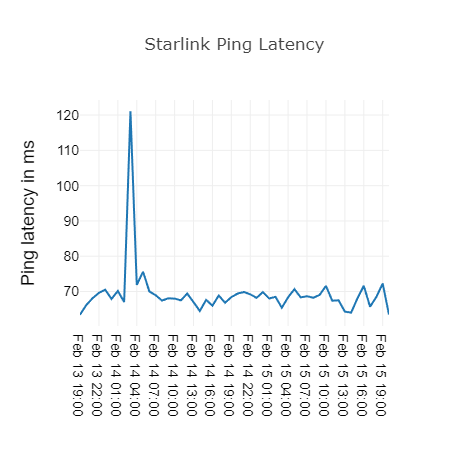
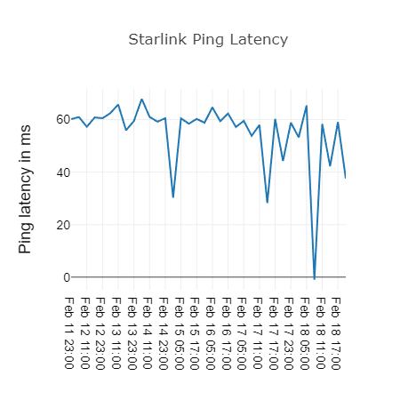
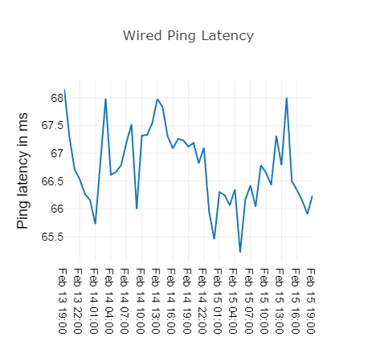
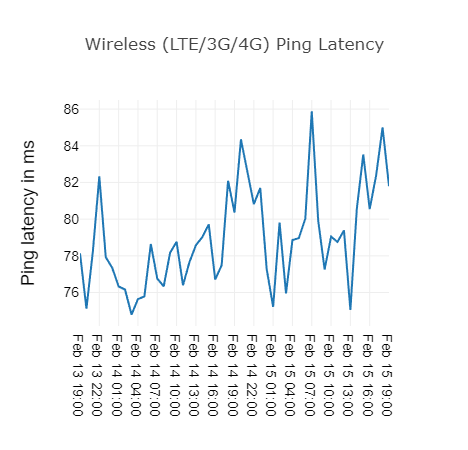

<h1 align="center">Connected Mobility Probe Report</h1>

# Introduction

Global measurement platforms such as RIPE Atlas allows users to measure internet acitivity and network accessibility through physical and software probes. The availiability of these platforms enables users to troubleshoot issues and identify bottlenecks when accessing different network service from various locations around the world. The objective of this assignment is to identify the major factors which affect the overall internet performance in terms of the routing path between clients and servers, as well as the last-mile technology used for communicatoin.

# Measurement Steps

In this chapter we describe how we set up our measurements. In the first subsection we describe how we filtered out around 400 probes out of the over 12.8K probes that are deployed within the RIPE Atlas network. In the second subsection we describe what the parameters were that we used to conduct the measurements. In the last subsection we disscuss if and how our probe selection represents the global mobile connectivity.

## Probe Selection

To reproduce our probe selection we provide the shell script do_probe_selection.sh in [probe_selection folder](https://github.com/floh22/cmb-atlas-results/tree/master/probe_selection). 

The script has the following packages as prerequisites:
- wget
- python3
- bunzip2

It does the following steps to retrieve suitable nodes. 
1. Some setup, like creating folders and moving/copying files
2. Retrieving the latest probe list provided by RIPE Atlas
3. Filter the probes as per description below
4. Separate the probes by type and continent 
5. Move the probe list to the desognated folders

The probe selection we used is based on the list as provided by RIPE Atlas on 11-Feb-2023 and can be retrieved [here](https://ftp.ripe.net/ripe/atlas/probes/archive/2023/02/20230210.json.bz2). To reproduce our result list with the provided scripted please exchange the url in line 29 in the do_probe_selection.sh file with this link [https://ftp.ripe.net/ripe/atlas/probes/archive/2023/02/20230210.json.bz2](https://ftp.ripe.net/ripe/atlas/probes/archive/2023/02/20230210.json.bz2). 

In the following section the filter criteria are explained. 

### Starlink
| Filter | Description |
| ----------- | ----------- |
| asn_v4 == 14593 \|\| asn_v6 == 14593| We filtered by the Autonomous System Number associated with Starlink|
| status == 1| We only used nodes that were reported as active| 

We did not filter by starlink in tags as this did not generate additional nodes.

#### Mobile Data
| Filter | Description |
| ----------- | ----------- |
| status == 1| we only used nodes that were reported as active|
| tags don't contain ['dsl', 'vdsl', 'vdsl2', 'adsl', 'fibre' or 'ftth']| we consider only wireless nodes without a wired connection to ISP|
| tags don't contain  'datacenter'| we considered only nodes that were not installed in datacenters|
|tags contain at least one of  ['3g', '4g', 'lte', '5g', 'mobile'] |we considered only nodes that are tagged with mobile technologie|

#### Home WI-FI:
| Filter | Description |
| ----------- | ----------- |
| status == 1| we only used nodes that were reported as active|
| tags don't contain ['dsl', 'vdsl', 'vdsl2', 'adsl', 'fibre' or 'ftth']| we consider only wireless nodes without a wired connection to ISP|
| tags don't contain  'datacenter'| we considered only nodes that were not installed in datacenters|
|tags contain at least one of ['wifi-mesh', 'system-wifi', 'public-wifi', 'wifi', 'wi-fi', 'free-wifi', 'wlan'] | we considered only nodes that are tagged with wifi|

### Home LAN
| Filter | Description |
| ----------- | ----------- |
| status == 1| we only used nodes that were reported as active|
|tags contain at least one of ['dsl', 'vdsl', 'vdsl2', 'adsl', 'cabel', 'fibre' or 'ftth']|we consider only nodes with a wired connection to ISP|
|tags don't contain  ['wifi-mesh', 'system-wifi', 'public-wifi', 'wifi', 'wi-fi', 'free-wifi', 'wlan'] | we don't considered  nodes that are tagged with wifi|
|tags don't contain  ['3g', '4g', 'lte', '5g', 'mobile'] |we don't considered  nodes that are tagged with mobile technologie|
|tags contain one of ['home', 'office' , or 'academic'] | we only consider probes that are tagged as home or office or academic|
|country_code in list of country codes of either wifi, mobile or starlink| to ensure that we have nearby nodes we considered as many nodes that had the same country code as the others up to a maximum number of five per country.|

## Measurements

We performed measurements over two different time horizons.
One long term another over a shorter time frame with measurements more often.

The results of the long term measurements can be found [here](https://github.com/floh22/cmb-atlas-results/tree/master/long_term_measurements/measurements), the results of the other measurement [here](https://github.com/floh22/cmb-atlas-results/tree/master/measurements)

In the following two parts we describe the parameters that we used to gather our measurements. First the parameters we used for the ping measurements, second the traceroute measurements. In general the parameters between the two different time horizons are the same except where it is highlighted. 

### Ping parameters
|Parameter| Setting|
| ----------- | ----------- |
| Target | google server on the same continent (exception Africa which also uses europe ):  <ul><li>us-central1.gce.cloudharmony.net</li><li>europe-west3.gce.cloudharmony.net</li><li>asia-northeast2.gce.cloudharmony.net</li><li>australia-southeast1.gce.cloudharmony.net</li><li>southamerica-east1.gce.cloudharmony.net</li></ul>|
| Interval (s) | <ul><li>Long time frame: 21600</li><li>Short time frame: 1800</li></ul>|
| Packets | 3|
| Size | 48 |
| Address Family | IPV4 |
| Resolve on Probe |False |

### Traceroute parameters
|Parameter| Setting|
| ----------- | ----------- |
| Target | google server on the same continent (exception Africa which also uses europe ):  <ul><li>us-central1.gce.cloudharmony.net</li><li>europe-west3.gce.cloudharmony.net</li><li>asia-northeast2.gce.cloudharmony.net</li><li>australia-southeast1.gce.cloudharmony.net</li><li>southamerica-east1.gce.cloudharmony.net</li></ul>|
| Interval (s) | <ul><li>Long time frame: 86400</li><li>Short time frame: 21600</li></ul>|
| Protocol | TCP |
| Address Family | IPV4 |
| Response Timeout (ms)| 4000 |
| Packets | 3 |
| Port | 80 |
| Size | 48 |
| Paris | 16 |
| Maximum Hops | 32 |
| Resolve on Probe | False |

## Disscusion

By choosing our nodes like described above we cannot claim that it represents the global mobile connectivity. The selected nodes do massively overrepresent internet users in Europe and North-America and even here it has been shown that the average connection of a RIPE probe is better than a typical connection of a given region [[1]].
A proposed reason behind this overrepresentation of above average connection is that this lies in the voluntary of the RIPE Atlas platform. As the participating hosts of the probes are donating some of their network capacity it is inferred that they have an above average connection where a few bytes more traffic are not of much consequence [[1]].
This is a problem that is inherent with the platform and not with our selection of nodes, so we are able to say that given the use of the RIPE Atlas our probe selection represents the  global mobile connectivity. 

Fig 2. Probe Location by country

# Results and Discussion

The analysis was conducted using latency as the major metric, and the experiments were varied based on 2 factors namely (1) the impact of different technologies used by networks, (2) the impact of distance between the probes and the cloud centers.

## Access Technology Comparison and Analysis

  

    <figcaption>Fig 3. Variation of average, minimum and maximum ping latency with technology.</figcaption>

  
&nbsp; &nbsp; &nbsp; &nbsp;
  

Fig 4. Starlink ping average in both long and short term tests

  
&nbsp; &nbsp; &nbsp; &nbsp;
  

Fig 5. Home and Wireless ping average in long term tests

These results were obtained by grouping all pings by the same node and then looking at the average, maximum, and minimum ping latency for every given node. These were then averaged across the node's specific connection technology.

### Wired 

Wired connections were the most stable of all technologies studied. The average best and worst case pings from wired connections within europe only had a range of 20ms, ranging from 29ms to 48.6ms, with the average at around 33ms. This small range shows that despite progress in wireless technologies, a physical connection is still the most reliable technology available and should be used when possible if reliability and low latency are priorities.

This was also the connection type where we could see the highest correlation between distance and latency. As we can see in Fig 2. and barring a few outliers, ping between server and device roughly linearly correlates to the distance between the device and our server. This Figure shows measurements from Europe, but all regions showed similar behavior.

<figure align="center">
  
  <figcaption>Fig 6. Variation of latency with probe-data center distance in Europe.</figcaption>
</figure>

### Wifi

Wifi was observed to be the most stable and reliable of the wireless technologies. Our theory is that this is due to the relatively static and short range nature of wifi environments. We assume that nodes connected to the RIPE Atlas network and using WIFI connections are both stationary, and in relatively close proximity to the network access point. This provides the ideal enviromenment for a wifi connection, which would explain our stellar results from WIFI. 

In comparison to a wired connection, WIFI actually was observed to have an average ping 9ms slower, which is roughly in line with the overhead one could expect from the extra access point between the end device and the rest of the network.

Average worst case deviation from the average ping was observed at around 40ms higher, meaning that with a global average of 76ms, the average worst case ping times of 113ms deviated relatively little from the average.

### 3G / 4G / 5G

To our surprise, this was observed to the worst performing technology in normal circumstances. While we had expected starlink devices to have the highest average latency, under normal conditions mobile data pings were around 80ms globaly.

### Starlink

# Conclusion

# References

[1]: <https://doi.org/10.1145/3487552.3487854> "The Khang Dang, Nitinder Mohan, Lorenzo Corneo, Aleksandr Zavodovski, Jörg Ott, and Jussi Kangasharju. 2021. Cloudy with a chance of short RTTs: analyzing cloud connectivity in the internet. In Proceedings of the 21st ACM Internet Measurement Conference (IMC '21). Association for Computing Machinery, New York, NY, USA, 62–79." 
[[1]]: The Khang Dang, Nitinder Mohan, Lorenzo Corneo, Aleksandr Zavodovski, Jörg Ott, and Jussi Kangasharju. 2021. Cloudy with a chance of short RTTs: analyzing cloud connectivity in the internet. In Proceedings of the 21st ACM Internet Measurement Conference (IMC '21). Association for Computing Machinery, New York, NY, USA, 62–79.
